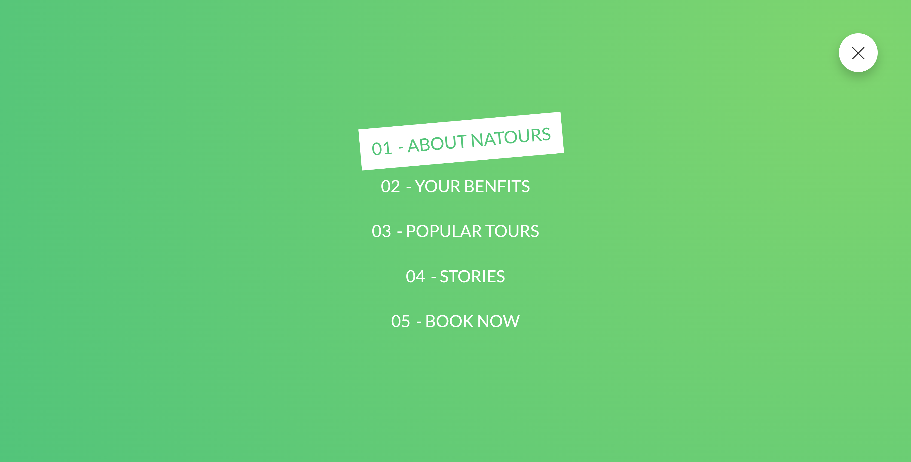
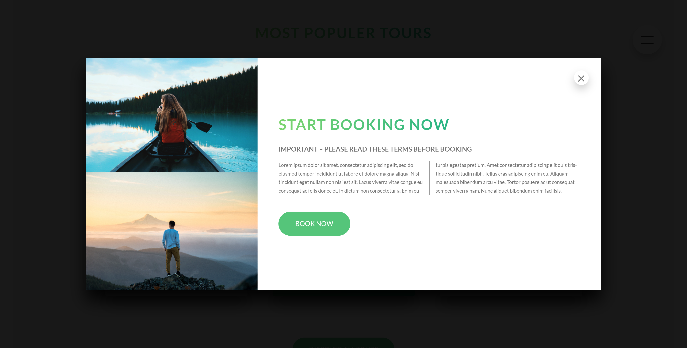

<div align="Center">


</div>

- Responsive Natours Website Using HTML, SASS
- Contains animations when clicking.
- Smooth scrolling in each section.
- Developed BEM with the desktop BEM methodology, then for mobile.
- Compatible with all mobile devices and with a beautiful and pleasant user interface.
#### If you want to maintain the project and use sass:

```js
npm install 

npm run compile:sass
```





